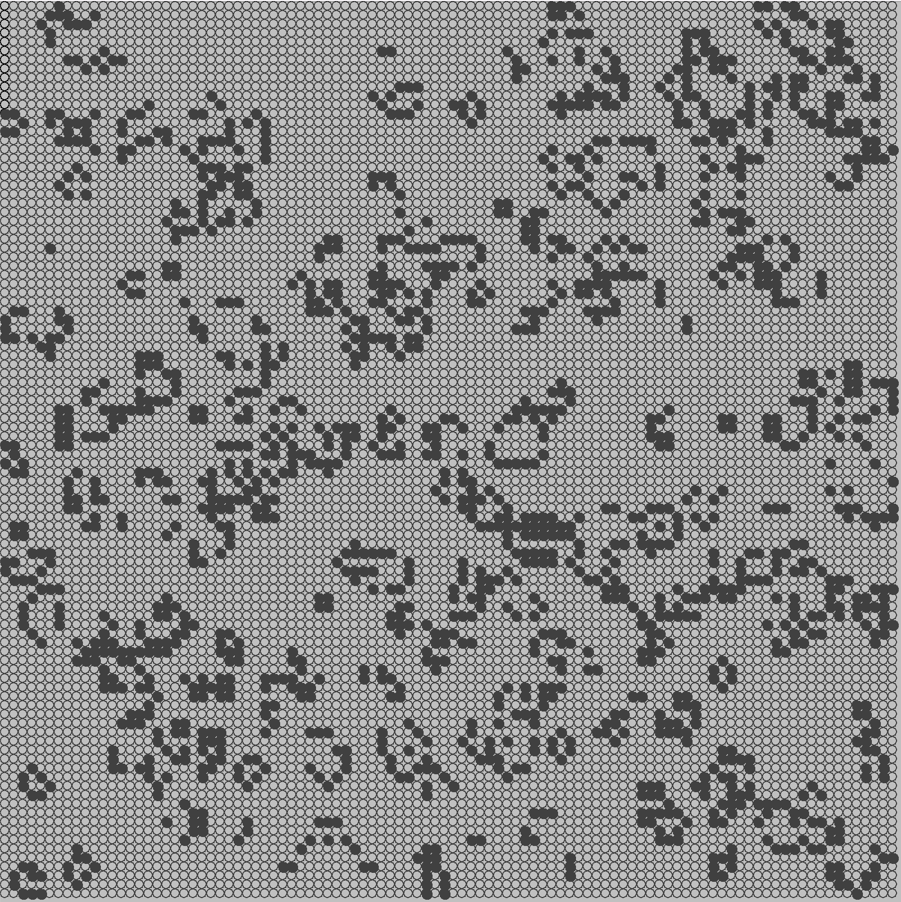
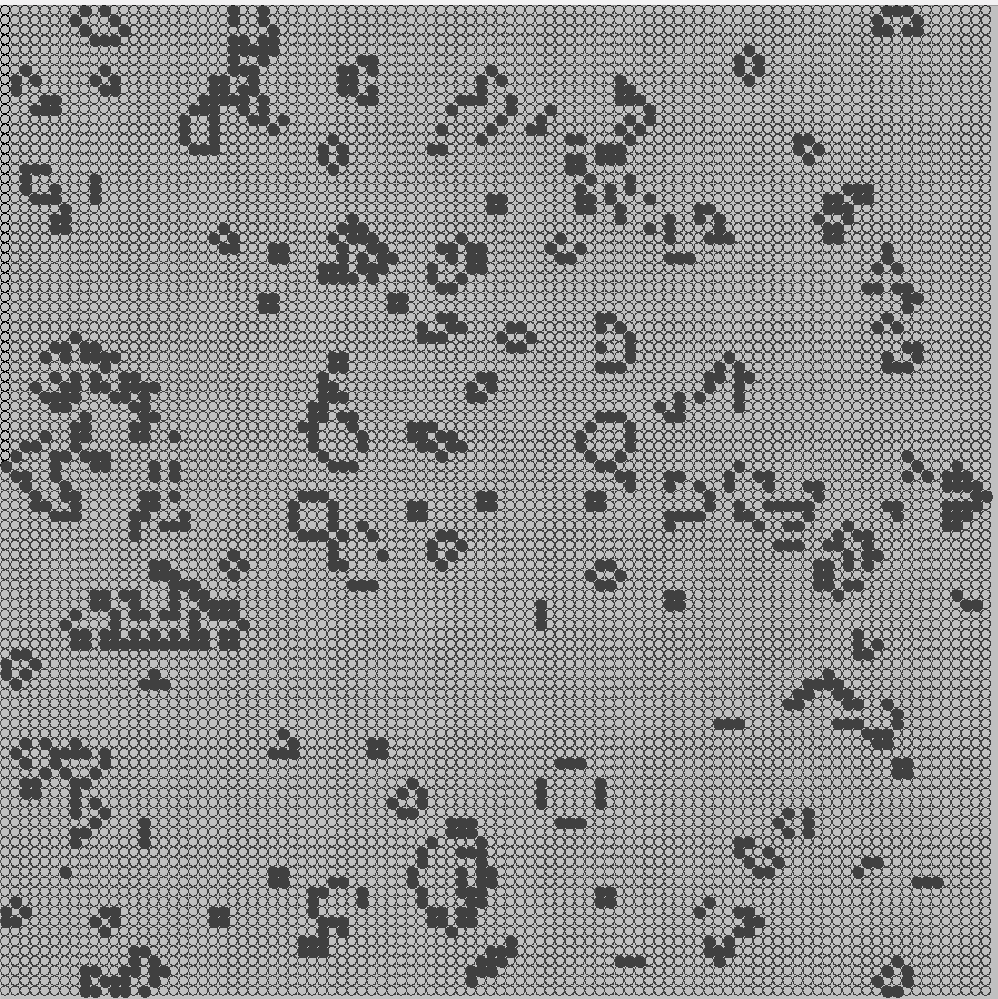
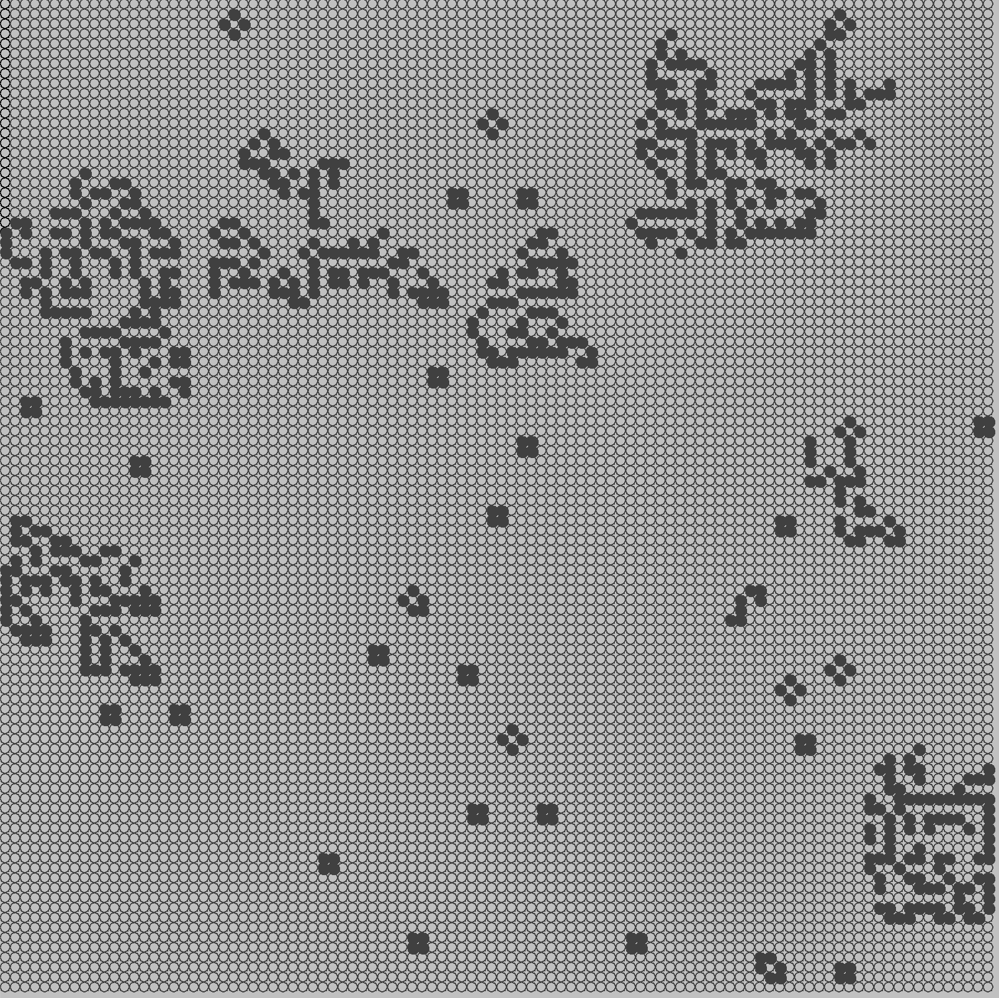
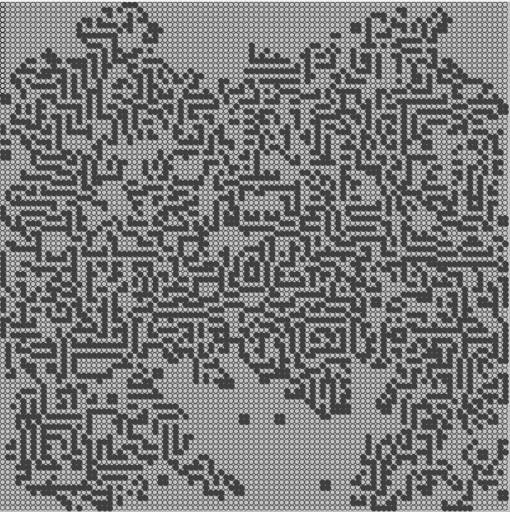

# GameOfLife
#### Conway's Game of Life implementation. A visual representation of cellular automata utilizing 2D arrays. 

To run the LifeSimulation, run in the terminal:
```
git clone https://github.com/JunnanShimizu/GameOfLife.git
```
```
cd GameOfLife
```
```
javac LifeSimulation.java
```
```
java LifeSimulation.java
```

Examples:

 


To run the VirusSimulation, in the same directory as above (GameOfLife), run in the terminal: 
```
javac VirusSimulation.java
```
```
java VirusSimulation.java
```

Examples:

 
